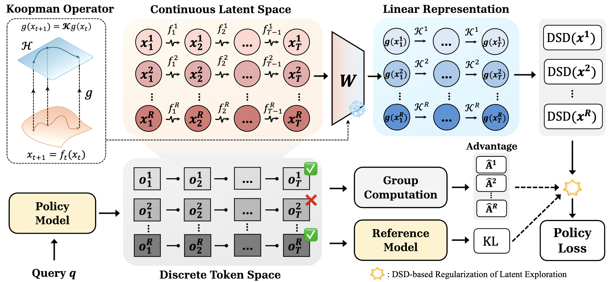

<div align="center">

<h1>
ReLaX: Reasoning with Latent Exploration for <br>
Large Reasoning Models
</h1>

</div>


<div align="center">

### 
<a href="https://scholar.google.com/citations?user=iDKLHNMAAAAJ&hl=zh-CN" target="_blank">Shimin Zhang</a><sup>#,1</sup> · 
<a href="https://scholar.google.com/citations?user=pHruUcwAAAAJ&hl=en" target="_blank">Xianwei Chen</a><sup>#,1</sup> · 
<a href="https://scholar.google.com/citations?user=BnGLjlgAAAAJ&hl=zh-CN" target="_blank">Yufan Shen</a><sup>#,2</sup> · 
<a href="https://voldet.github.io/" target="_blank">Ziyuan Ye</a><sup>1</sup> · 
<a href="https://www.jibinwu.com/" target="_blank">Jibin Wu</a><sup>†,1</sup>

<sup>1</sup> Hong Kong Polytechnic University,  <sup>2</sup> Shanghai Artificial Intelligence Laboratory  

<sup>#</sup> Equal contribution &nbsp;&nbsp;|&nbsp;&nbsp; <sup>†</sup> Corresponding author: jibin.wu@polyu.edu.hk

</div>

<br>

<div align="center">

<a href="https://arxiv.org/abs/2512.07558" target="_blank">
  
</a>

<a href="https://huggingface.co/datasets/REPLACE_WITH_RELAX_DATASET" target="_blank">
  
</a>

<a href="https://huggingface.co/REPLACE_WITH_RELAX_CHECKPOINTS" target="_blank">
  
</a>

</div>

---

## Background

Reinforcement Learning with Verifiable Rewards (RLVR) has become a core paradigm for improving Large Reasoning Models (LRMs), but it suffers from a fundamental exploration–exploitation tradeoff. Due to sparse rewards, RLVR training often drives the policy toward early exploitation with collapsed token-level entropy, resulting in insufficient exploration and premature convergence. Existing methods primarily mitigate this issue by encouraging exploration in the token space by lifting up entropy. While effective to some extent, such token-level interventions present two fundamental limitations:

- **Inherent conflict with RL optimization.** Enforcing higher token-level entropy contradicts the natural tendency of reinforcement learning to converge toward deterministic, low-entropy policies, creating structural tension that can hinder stable optimization.

- **Mismatch between token feedback and multimodal computation.** In mainstream MLLMs, cross-modal computation unfolds in latent representations while supervision operates on unimodal text outputs, causing token-level feedback to inadequately reflect the underlying multimodal processing.

> Consequently, merely boosting token-level entropy is neither an efficient nor a broadly generalizable strategy for effective exploration. This motivates the question of whether the **richer information inherent in latent representations** can be harnessed to guide a more principled exploration–exploitation tradeoff.

## Methodology

<div align="center">
  
</div>
</p>

Our central hypothesis is that *the fundamental cause of a policy model becoming overly deterministic and failing to explore lies in the rigid internal computations dictated by homogeneous latent dynamics*. To probe the high-dimensional and nonlinear latent dynamics of LRMs, we leverage **Koopman operator theory**, which enables analysis of the last-layer hidden states within a tractable linear representation space. Building on this linearization, we perform spectral analysis of the resulting operator and introduce a novel metric, **Dynamic Spectral Dispersion (DSD)**, to quantify the heterogeneity of the LRM’s latent dynamics.

We then incorporate DSD into the policy optimization objective, encouraging the model to maintain a relatively high level of DSD and thereby preventing the policy from collapsing into homogeneous trajectories. To ensure this exploration remains controlled rather than unrestrained, we introduce two complementary mechanisms:

- **Advantage shaping**: only trajectories with positive reward—corresponding to correct outcomes—are encouraged to increase DSD, focusing exploration on promising directions.

- **Adaptive KL regularization**: an upper bound is imposed on DSD; when this limit is exceeded, further encouragement of DSD is suspended, and KL regularization is applied to the token-level outputs as an elastic constraint to stabilize training.


## Experimental Results
Our experiments 

---

## Citation

```bibtex
@article{zhang2025relax,
  title   = {ReLaX: Reasoning with Latent Exploration for Large Reasoning Models},
  author  = {Zhang, Shimin and Chen, Xianwei and Shen, Yufan and Ye, Ziyuan and Wu, Jibin},
  journal = {arXiv preprint arXiv:2512.07558},
  year    = {2025}
}
